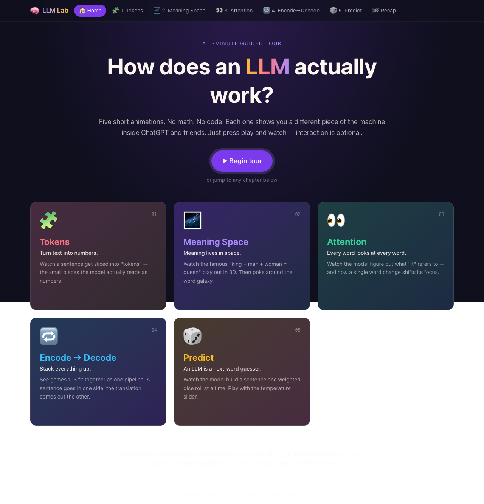
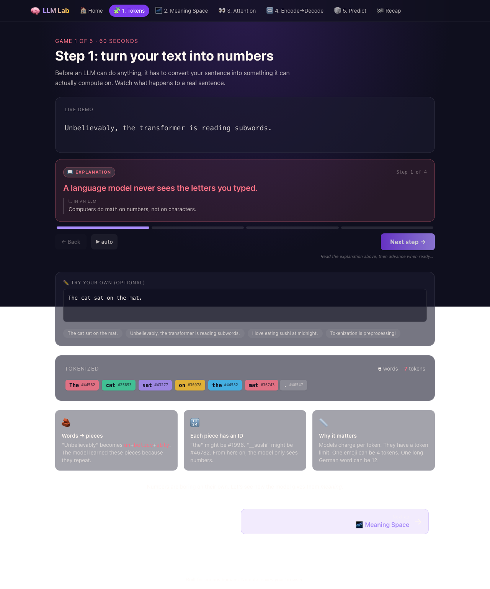
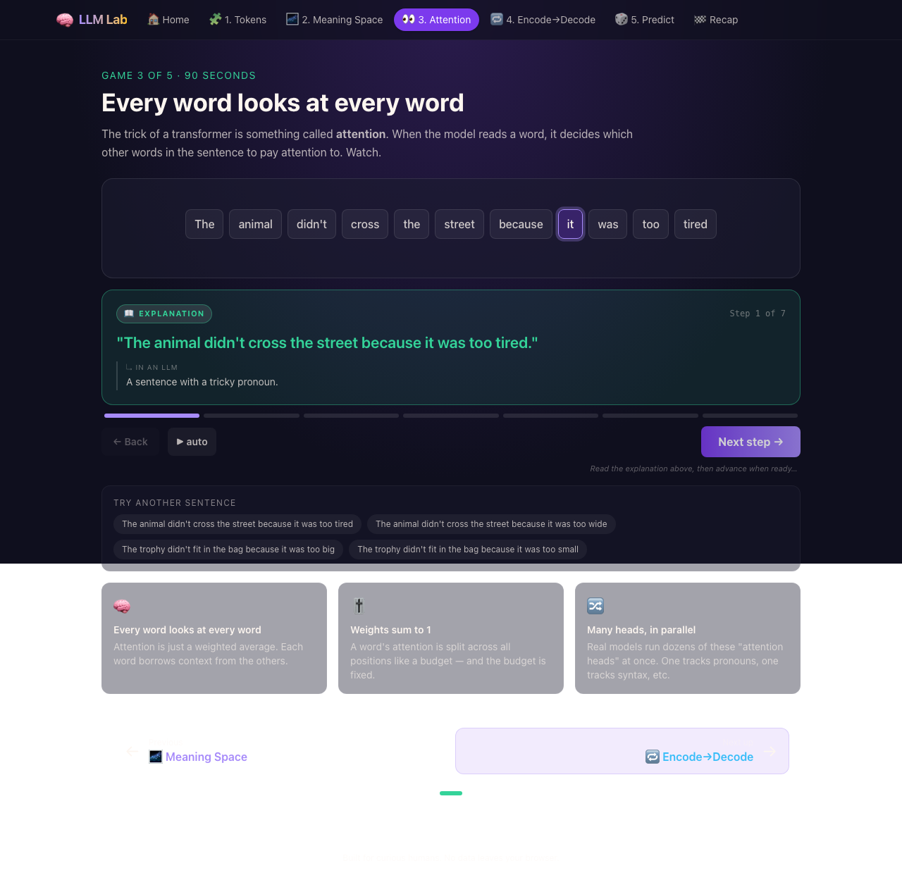
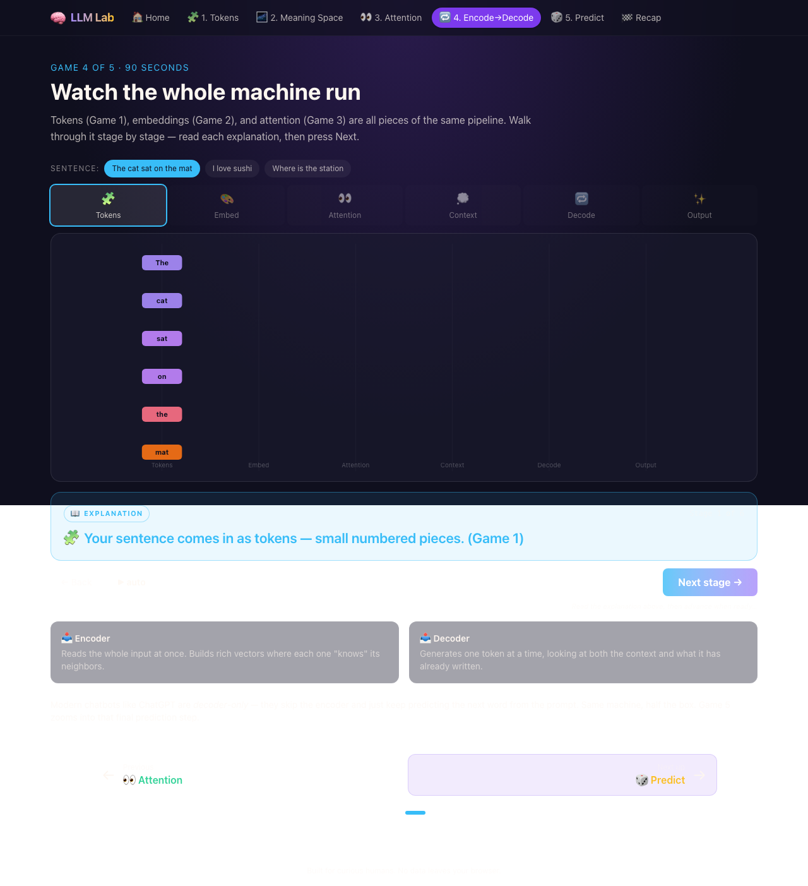
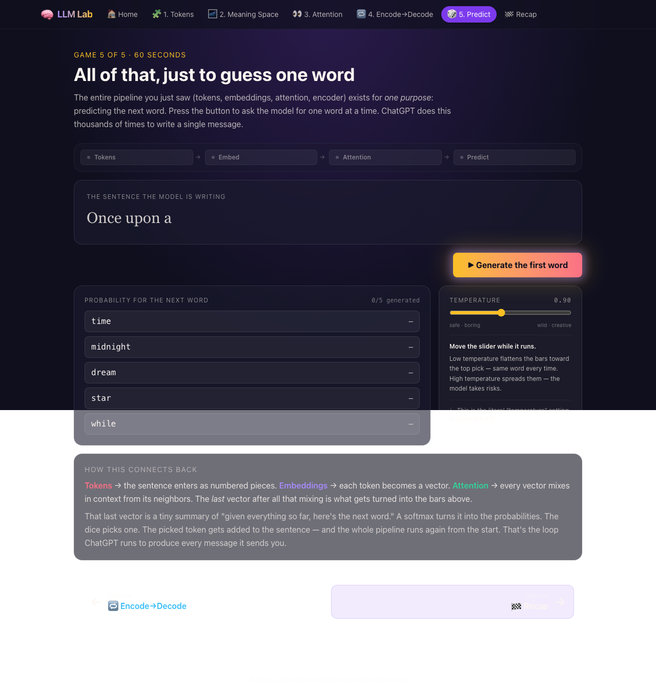

<div align="center">

# 🧠 LLM Explain Lab

### A 5-minute interactive tour of what's actually inside ChatGPT.

**No math. No code. No prior AI background needed.**

[**▶ Try it live →**](https://lionellau.github.io/llm-explain-lab)

<sub>Built by a tech mentor who got tired of explaining the same thing in every 1:1.</sub>



</div>

---

## Why this exists

I run regular mentoring sessions for engineers, students, and curious friends. After ChatGPT hit, the same question started showing up in almost every conversation:

> *"OK but how does this thing actually work?"*

For months I answered it the same way — with whiteboard scribbles, three or four favorite analogies, and a lot of arm-waving. The same drawings. The same metaphors. The same "imagine a galaxy of words" moment.

At some point it hit me: **if I'm explaining tokens, embeddings, attention, and next-token prediction this often, I should just turn the explanation into something everyone can play with.**

So I took the materials I use in mentoring sessions, distilled them into five short visual chapters, and built this lab. If you've ever wanted a clear, no-math answer to "how does an LLM work?" — or if you teach AI/ML and want something concrete to point your own mentees at — this is for you.

It's free, MIT-licensed, and runs entirely in your browser. Nothing leaves your machine.

---

## What you'll learn in 5 minutes

| # | Chapter | The big idea you walk away with |
|---|---|---|
| 1 | **Tokens** | The model doesn't read letters or words. It reads numbered sub-word pieces. |
| 2 | **Meaning Space** | Words become points in 3D space. Similar meanings cluster. Directions encode relationships (king − man + woman = queen, literally). |
| 3 | **Attention** | Every word looks at every other word and decides who matters. That's how the model knows what "it" refers to. |
| 4 | **Encode → Decode** | The full pipeline running end-to-end: tokens → vectors → attention → context → output. With actual motion. |
| 5 | **Predict** | An LLM is fundamentally a next-word guesser. You press a button, watch one word get generated, repeat. That's how ChatGPT writes every message it sends. |

Each chapter is one prominent "📖 Explanation" panel paired with a live animation. You read, you watch the visual update, then you press **Next** when ready. No quizzes. No friction. The Next button glows after a 3-second reading delay so you can take your time.

---

## A peek inside

<table>
<tr>
<td width="50%">

**Tokens — turn text into numbers**



</td>
<td width="50%">

**Attention — every word looks at every word**



</td>
</tr>
<tr>
<td width="50%">

**Encode → Decode — the whole machine**



</td>
<td width="50%">

**Predict — one weighted dice roll at a time**



</td>
</tr>
</table>

---

## How it's built

Vanilla web stack — open it on any modern browser, no install:

- **Vite + React 19 + TypeScript** — the app shell
- **Three.js + @react-three/fiber + drei** — the 3D meaning-space
- **Tailwind CSS v4** — styling
- **HashRouter** — so deep-links work on plain static hosting
- **Bun** — package manager and dev server

The visualizations are hand-crafted: there is no real GPT running under the hood. Every animation uses small, deterministic examples so you can clearly see one moving part at a time. The concepts are real; the data is curated for clarity.

### Security & privacy

- **Zero backend.** No API keys, no inference servers, no analytics.
- **Strict Content-Security-Policy** applied via both `vite.config.ts` and `public/_headers` (Netlify / Cloudflare Pages compatible).
- **No remote network calls** from the running app — `connect-src 'self'`.
- See [SECURITY.md](SECURITY.md) for the full threat model.

---

## Run it locally

```bash
git clone https://github.com/lionellau/llm-explain-lab.git
cd llm-explain-lab
bun install
bun dev
```

Open the printed URL (usually `http://localhost:5173`). Edit any file in `src/pages/` and the page hot-reloads.

To build the static bundle:

```bash
bun run build      # outputs to dist/
bun run preview    # serve the production build locally with the full CSP
```

Don't have Bun? You can use `npm install` and `npm run dev` instead — Vite supports both.

---

## For fellow mentors and educators

If you teach AI/ML and want to use this in a workshop, a class, or a 1:1 — please do. You can:

- **Deep-link to a specific chapter:** [`#/tokenizer`](https://lionellau.github.io/llm-explain-lab/#/tokenizer), [`#/embeddings`](https://lionellau.github.io/llm-explain-lab/#/embeddings), [`#/attention`](https://lionellau.github.io/llm-explain-lab/#/attention), [`#/encode-decode`](https://lionellau.github.io/llm-explain-lab/#/encode-decode), [`#/next-token`](https://lionellau.github.io/llm-explain-lab/#/next-token).
- **Fork the repo** and rewrite the explanations in your own voice. All narration lives as plain arrays in `src/pages/*.tsx` and `src/data/*.ts`.
- **Adapt the data:** add your own analogy puzzles in `src/data/embeddings.ts`, attention-resolution sentences in `src/data/attention.ts`, next-token prompts in `src/data/nextToken.ts`.

If you do use it, I'd love to hear how it went. Open an issue or ping me.

---

## Roadmap (open to contributions)

- [ ] "Show the math" toggle for learners ready for the next layer of depth
- [ ] Localized narration (Chinese, Spanish, Japanese to start)
- [ ] Optional audio narration for accessibility
- [ ] More attention puzzles — longer sentences, multi-pronoun cases
- [ ] A "Training" chapter showing how the model learns these patterns in the first place

PRs welcome. Issues with concrete teaching use-cases especially welcome.

---

## About the author

**Lionel Lau** — Senior engineer & tech mentor. I run regular mentoring sessions for engineers at different career stages, and this project came out of fielding the same handful of LLM questions every week. If you've ever sat across from me at coffee and asked *"so what's an embedding actually?"* — this is the answer I wish I'd handed you instead of drawing on a napkin.

- GitHub: [@lionellau](https://github.com/lionellau)

If this saved you an hour of explaining things to someone — that's exactly what I built it for.

---

## License

[MIT](LICENSE) — use it, fork it, ship it, teach with it. A link back is appreciated but not required.

## Credits

The pedagogical approach borrows from several outstanding explainers I studied while building this:

- [3Blue1Brown — But what is a GPT?](https://www.3blue1brown.com/lessons/gpt/)
- [Polo Club's Transformer Explainer](https://poloclub.github.io/transformer-explainer/)
- [Jay Alammar — The Illustrated Transformer](https://jalammar.github.io/illustrated-transformer/)

If you want to go deeper after this lab, those are the next stops.
